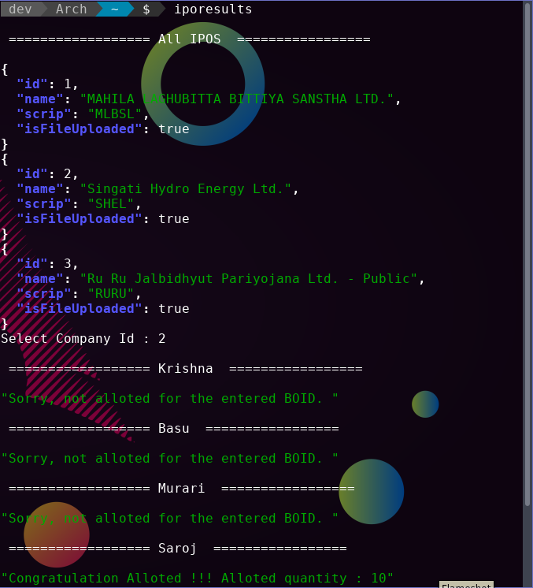

# Meroshare Client Bash
It is a terminal based app to see the iporesults of all the members of your family or friends in with one command

### Running
```
iporesults
```

### Installtion
Clone this repository
```
git clone https://github.com/basu-dev/iporesults-bash-client.git

```
Add the path to the file iporesults in the .bashrc file

```
export PATH=$PATH:"{pwd}/iporesults-bash-client/"
```

Relaunch your terminal and type 
```
iporesults
```

It will give some errors because it searches for the name and boid number of your friend or family in the file called .boid.txt inside .secrets folder in home directory so to create the file type:

```
mkdir ~/.secrets/
cd ~/.secrets
touch .boid.txt
```
Inside .boid.txt file insert the Name and Boid of your family or 
friends in following pattern
```
John 2353344533344
Harry 2556324556677
```
Save the file and after you launch the terminal and type iporesultsit will give results of all the friends or family members 
```
iporesults
```
### Output Demo


### Future Improvement
I will add a feature of adding the name and boid with command line in stead of editing the ~/.secrets/.boid.txt file yourself as following :
```
iporesults add Phillips 2356545666
```
And to remove the family member
```
iporesults remove Phillips
```
I will try to make AUR package for arch users.


